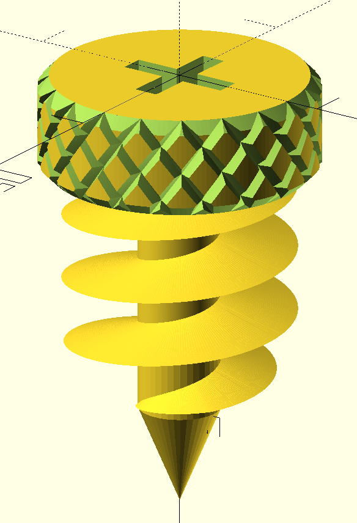

# cardboard-creative-construction-set
This is a set of parts (typically openSCAD) for creating cardboard toys and creations (Similar to makedo)

Contributions encouraged 

By default any code in this codebase is GPLed unless stated otherwise in the source code.

Key thing about these designs:
- Less focus on kid safety, so no need to have rounded tips.
- More focus on ease of use by teenagers and upwards
- Less need for specialise tooling unlike Makedo which required their own 

## Screws

This design was inspired by https://www.thingiverse.com/thing:4245596 but is redone in OpenSCAD to encourage other designers more familiar with OpenSCAD to modify and remix cardboard screws.

This particular design is designed with these features:
- Knurled knob so that you can screw it into cardboard with just your thumb
- The sizing of the thread is emulating the makedo thread dimension so it can be used with makedo hinges (untested)
- Instead of proprietary makedo screw, the screwhead for this screw is for most typical phillips and flathead screwdrivers. This means one less tools required by a user. (Especially in the context of this screw being used in warehouses for screwing down cardboard lids etc...)

## Saws

Just use <https://github.com/brvdboss/cardboard_saw-makedo_compatible> (Also posted to <https://www.thingiverse.com/thing:4736367>), as brvdboss's design works well already. It's reasonably kids safe anyway, but has the advantage of being efficient with plastic usage. Also on manual test, it works pretty well on cardboard. And many adults that could be trusted with a screwdriver, cannot be trusted with a saw on the other hand.

## Utils

These are specific standalone code that maybe of use in other project.

For example:
- KnurlSimplified (Also posted to https://www.thingiverse.com/thing:6445303 )